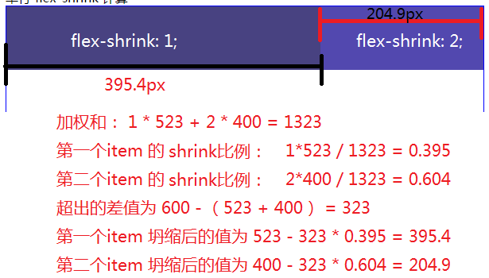

### flex布局

> 如何理解flex布局？

**误区 ：**对`flex-item`设置`flex: 1` ，另一个`flex-item`设置`flex: 2` ，后者将是前者宽度的两倍。好的这是错误的。

**更正：** 对于`flex` 布局来说，有必要先去计算每一个`flex-item`的初始内容宽度，这样才能继续后续的布局计算。


### 初始内容宽度

> 这里暂时没有考虑极端情况，比如`flex-item` 撑爆容器

```js
/*
在别人的博客看到了以下的初始内容宽度的计算情况：

- flex-basis 的优先级比 width[height]: 非auto; 高，
- 元素存在默认宽高，看默认宽高和flex-basis谁比较宽
- 元素存在 min-width[height] 或者 max-width[height]，看min-width和flex-basis谁比较宽
- width[height]: auto; 优先级等于 flex-basis。
*/
```


总结一下：

- 没有设置width，flex-basis，min-width时，只要`flex-item`内部没有超出flex-grow之后的字母或数字或内联元素（如input表单），则默认内容宽度其实是0
- 设置width，只是给了`flex-item`一个最大的宽度限制，可以避免到出现上面的内联元素顶开`flex-item`的情况。然而这个最大宽度限制是对于被内部元素顶开这种情况而言的，并不会阻止`flex-grow`
- 设置了`flex-basis`之后，`width`就没啥用了，想要限制最大最小宽度可以使用`min-width`和`max-width`
- 总的来说影响初始内容宽度的，只有`flex-basis`，其余的问题都是因为内容顶出去了，或者`min-width`限制，而这两个因素都是直接把`flex-item`顶开的，而不是顶开初始内容宽度。


### flex grow

当清楚了初始内容宽度之后。`flex-grow`的布局规则就是：初始内容宽度排过去，把容器剩余空间抽出来，按照`flex-grow` 进行按比例划分，分给各个`flex-item`


​										执行grow前


​										执行grow后


### flex shrink

当初始内容宽度超出的时候（`flex-warp: nowarp`），会通过flex-shrink进行压缩，具体的步骤是把超出的空间抽出来，按照flex-shrink的值进行按比例划分，分好后再用对应的`flex-item`减去对应的值


​										执行shrink前



​										执行shrink后


### 总结

理解flex布局，主要是要理解`flex-item` 的初始内容宽度。flex布局的效果都是基于这个宽度完成的