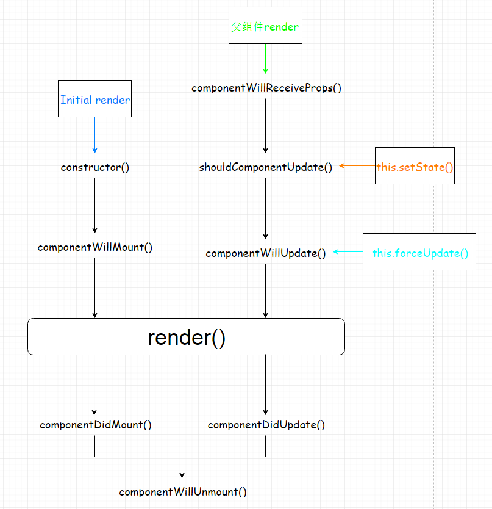

### React vs Vue

#### 使用上

##### Vue的`v-`指令方便开发，特别是`v-model`

##### 对于HTML上

> Vue使用模板写HTML轻轻松松的。React崇尚纯`JS`，对于HTML的生成上，`React`采用JSX来实现

##### CSS上

> Vue的单文件组件形式，结合了`scoped`进行CSS作用域的限制，很方便进行了CSS分离（但是我之前配合Vue-Router使用的时候会有BUG，就是路由切换之后有相同的类名会复用样式，可能是Vue做的优化）。而React使用的是单独的CSS文件，通过`webpack`的`css-loader`+`style-loader`进行样式引入。同样是一种CSS模块化的实现方式。

##### 组件和生命周期上

> 两个框架都提供了一套十分完善的组件化开发模式，不得不说组件化开发的前端项目真的很好，组件封得好，效率加一半。前端来说通过页面拆分成功能粒度合适的组件封装，通过`props`传入适当的配置，十分轻松可以达到高复用性和很好的维护性的目的。配合起MVVM的架构模式开发，HTML模板写好，剩下的逻辑都只需要对数据进行操作，十分轻松。
>
> 说到组件不能不提生命周期，两个框架的组件系统都有很完善的生命周期函数，会按照约定在组件创建和插入DOM或者卸载的时候触发，因为生命周期都是一些十分特殊的时间点，所以在Hook上面加操作往往十分有用。
>
> 值得注意的是：服务端渲染没有挂载到DOM的过程，所以组件的部分生命周期函数不会被调用

##### 配套工具

> 对比起 React，Vue 拥有专门属于 Vue 的配套路由工具，状态管理器，插件等，这些配套的库更具针对性

##### 计算属性

> Vue有提供计算属性，可以依赖于data更新而更新，而不用在返回的模板中通过函数处理data的相关属性。

##### 数据上

> React官方建议把State当作是不可变对象（immutable）的（出于性能考虑，当对象组件状态都是不可变对象时，我们在组件的`shouldComponentUpdate`方法中，仅需要比较状态的引用就可以判断状态是否真的改变，从而避免不必要的`render`调用。）；Vue中的数据是可变（mutated）的，Vue 由 data 进行驱动，所以同样的操作看起来更加简洁。

#### 底层上

##### Virtual DOM

> `Vue2.0`引入了`Virtual DOM`，进一步提升组件渲染的性能。`React` 本来就有`Virtual DOM` 。
>

##### 更新方面

> 虽然两个框架都集成了`Virtual DOM`，但是他们的DOM更新也是有差异的
>
> React的一般调用`setState`更新组件的State，从而触发render更新，然而调用render函数可能会导致这个组件下的所有子组件也调用render函数进行重新构建（即使这个组件的渲染完全没有改变），所以我们可以通过`shouldComponentUpdate`来阻止组件的更新，从而进行性能优化
>
> 而Vue一般来说不需要，因为Vue底层是用`setter`和`getter`访问器属性实现MVVM绑定的。
>
> `getter`: 主要是添加订阅者,维护一个订阅者数组,return val
> `setter`: view => model(输入而改变vm中的data数据), model => view(dep.notify()去遍历所有的订阅者,update数据,从而改变相关的文本节点数据)
>
> 所以Vue采用依赖追踪，默认就是优化状态，并不会有多余的重新组件渲染

##### 上手

> Vue项目能不需要转译直接使用在浏览器中， 而react更多的依赖jsx和class等ES6属性。

#### 其他

- 都支持服务端渲染
- 都集成了`Virtual DOM`，使页面渲染的速度加快
- 都有配套的路由工具，状态管理器，各种 middleware，plugin
- 都实现了组件化，模块化
- Vue 使用模板（数据绑定表达式采用的是和 Angular 相似的 mustache 语法，而指令（特殊的HTML属性）用来向模板添加功能）；React 不使用模板，但是借助 JSX 在 JS 中创建 DOM。

- 不同的写法：Vue 使用模板，React 不使用模板，但是借助 JSX 在 JS 中创建 DOM。
- React官方建议把State当作是不可变对象（immutable）的（出于性能考虑，当对象组件状态都是不可变对象时，我们在组件的`shouldComponentUpdate`方法中，仅需要比较状态的引用就可以判断状态是否真的改变，从而避免不必要的`render`调用。）；Vue中的数据是可变（mutated）的，Vue 由 data 进行驱动，所以同样的操作看起来更加简洁。

### React的优势

- 虚拟DOM
- MVVM数据驱动
- 优秀的组件化开发方案
- 配合`react-hot-loader`的良好开发体验
- 较为完整的路由和数据处理方案
- 社区比较活跃

### Vue的优势

- 虚拟DOM
- MVVM数据驱动
- 优秀的组件化开发方案
- `vue-loader`配合单文件组件开发体验良好
- HTML可以用模板写
- 数据修改方便
- 完整的路由和数据处理方案
- 容易上手，开发轻松，一系列模板指令能让开发效率提升
- 简单轻松的CSS模块化方案（只要加个scoped），而React需要做CSS模块化方案则需要通过配置各种loader，通过`import`进来组件实现，通过开启`css-loader`的Module，来实现样式模块化。

